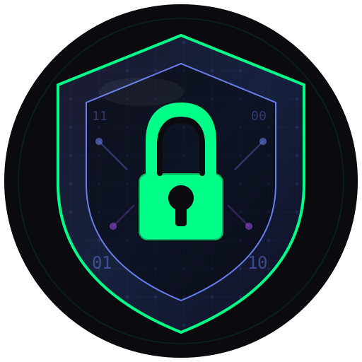

# ShadowHack — Ethical Hacking Learning Platform

<div align="center">



**منصة شاملة لتعلم اختبار الاختراق الأخلاقي وأمن المعلومات**

[](https://react.dev/)
[](https://flask.palletsprojects.com/)
[](https://tailwindcss.com/)
[](https://docker.com/)

</div>

---

## 📖 About

**ShadowHack** is a full-stack cybersecurity education platform inspired by HackTheBox and TryHackMe, targeting Arabic-speaking security students. It provides a complete learning environment from beginner to expert level.

### Key Features

| Feature | Description |
|---|---|
| 🎓 **Structured Learning** | Courses, OWASP modules, career tracks (Red Team, Blue Team, SOC) |
| 🐳 **Docker Labs** | Real containers spawned per user for hands-on practice |
| 🚩 **CTF Challenges** | Daily and room-based Capture The Flag competitions |
| 🛠️ **50+ Security Tools** | Payload generator, recon, OSINT, exploit tools, and more |
| 🤖 **AI Assistant** | Groq-powered chatbot with hacker personas |
| 🏆 **Gamification** | XP, levels, leagues, achievements, certificates |
| 👥 **Teams & Chat** | Real-time collaboration via Socket.IO |
| 📊 **Analytics** | Skill tracking and progress dashboards |
| 🌐 **Bilingual** | Full Arabic (RTL) and English support |

---

## 🏗️ Architecture

The project consists of three main layers:

```
ShadowHack/
├── study-hub-react/          # Modern React Frontend (PRIMARY)
│   ├── src/
│   │   ├── pages/            # 60+ page components
│   │   │   ├── tools/        # 40+ security tool pages
│   │   │   ├── ctf/          # CTF room pages
│   │   │   ├── labs/         # Lab management pages
│   │   │   └── paths/        # Career path pages
│   │   ├── components/       # Shared UI components
│   │   ├── context/          # React Context (AppContext, ToastContext)
│   │   ├── hooks/            # Custom hooks (useLabManager, useMissionSystem)
│   │   ├── services/         # API service layer
│   │   └── lib/              # Third-party lib wrappers (supabase, etc.)
│   ├── vite.config.js        # Vite build config with code splitting
│   └── package.json
│
├── backend/                  # Python Flask Backend (API)
│   ├── main.py               # App factory + startup
│   ├── models.py             # SQLAlchemy ORM models
│   ├── auth_routes.py        # JWT authentication
│   ├── api_routes.py         # Core API endpoints
│   ├── analytics_routes.py   # Analytics & skill tracking
│   ├── docker_lab_manager.py # Docker container orchestration
│   ├── gamification_engine.py# XP, levels, badges
│   ├── ai_manager.py         # Groq AI integration
│   ├── terminal_socket.py    # Socket.IO terminal namespace
│   ├── intel_manager.py      # Live security news feeds
│   └── requirements.txt
│
├── index.html                # Legacy vanilla JS frontend (deprecated)
├── CSV links/                # YouTube course datasets
└── docker/                   # Docker infrastructure configs
```

---

## 🚀 Quick Start

### Prerequisites

- **Python** 3.10+ 
- **Node.js** 18+
- **Docker** (optional, required for live labs)
- **Git**

---

### 1. Clone the Repository

```bash
git clone https://github.com/your-username/shadowhack.git
cd shadowhack
```

---

### 2. Backend Setup

```bash
cd backend

# Create and activate virtual environment
python -m venv venv

# Windows
venv\Scripts\activate
# macOS/Linux
source venv/bin/activate

# Install dependencies
pip install -r requirements.txt

# Create environment file
cp .env.example .env
# Edit .env and fill in the required values (see Environment Variables section)

# Run the backend server
python main.py
# Backend starts at http://localhost:5000
```

---

### 3. Frontend Setup

```bash
cd study-hub-react

# Install dependencies
npm install

# Create environment file (optional — only needed for Supabase)
cp .env.example .env.local

# Start development server
npm run dev
# Frontend starts at http://localhost:3000
```

The Vite dev server proxies `/api` requests to `http://localhost:5000` automatically.

---

### 4. Build for Production

```bash
cd study-hub-react
npm run build
# Output is in study-hub-react/dist/
```

---

## ⚙️ Environment Variables

### Backend (`backend/.env`)

| Variable | Required | Description |
|---|---|---|
| `SECRET_KEY` | ✅ | Flask secret key (use a long random string) |
| `JWT_SECRET` | ✅ | JWT signing secret (use a long random string) |
| `DATABASE_URL` | ⚠️ | PostgreSQL URL for production. If unset, SQLite is used. |
| `PLATFORM_ACCESS_CODE` | ⚠️ | Invite-only gate password. If unset, the platform is open. |
| `GROQ_API_KEY` | ⚠️ | Groq API key for AI assistant features |
| `FLASK_ENV` | optional | Set to `development` to enable debug mode and relaxed CORS |
| `CORS_ORIGINS` | optional | Comma-separated list of allowed frontend origins |
| `RATELIMIT_STORAGE_URI` | optional | Redis URI for rate limiting (e.g. `redis://localhost:6379/0`). Defaults to in-memory. |
| `SMTP_SERVER` | optional | SMTP server for password reset emails |
| `SMTP_PORT` | optional | SMTP port (default: 587) |
| `SMTP_EMAIL` | optional | SMTP sender address |
| `SMTP_PASSWORD` | optional | SMTP sender password |
| `FRONTEND_URL` | optional | Frontend URL for password reset links |

Generate secure values with:
```bash
python -c "import secrets; print(secrets.token_hex(32))"
```

### Frontend (`study-hub-react/.env.local`)

| Variable | Required | Description |
|---|---|---|
| `VITE_SUPABASE_URL` | optional | Supabase project URL (if using Supabase auth) |
| `VITE_SUPABASE_ANON_KEY` | optional | Supabase anonymous key |

---

## 🐳 Docker Labs

To enable the live hacking lab infrastructure, Docker must be running:

```bash
# Start Docker Desktop (Windows/macOS) or the Docker daemon (Linux)
# Then start the backend — it will auto-detect Docker

cd backend
python main.py
# Look for: [OK] Docker Labs: ENABLED - Containers available
```

If Docker is not available, the backend runs in **simulation mode** — lab UI works but containers aren't actually spawned.

---

## 📦 Tech Stack

### Frontend
- **React 19** + **Vite 7**
- **TailwindCSS v4** for styling
- **Framer Motion** for animations
- **React Router v7** for navigation
- **Lucide React** for icons
- **xterm.js** for in-browser terminal
- **Socket.IO Client** for real-time features

### Backend
- **Flask 3** + **Flask-SQLAlchemy** for ORM
- **Flask-SocketIO** + **gevent** for WebSocket support
- **Flask-CORS** for cross-origin requests
- **Flask-Limiter** for rate limiting
- **PyJWT** for authentication
- **Werkzeug** for password hashing
- **Docker SDK** for lab container management
- **Groq** for AI integration
- **ReportLab** + **Pillow** for certificate generation

### Database
- **SQLite** (development)
- **PostgreSQL** (production — Render, Heroku, etc.)

---

## 🌐 Deployment

### Frontend → Vercel

The `study-hub-react/vercel.json` is already configured:
```json
{
  "buildCommand": "npm run build",
  "outputDirectory": "dist",
  "rewrites": [{ "source": "/(.*)", "destination": "/index.html" }]
}
```

1. Push `study-hub-react/` to a GitHub repo
2. Import into Vercel
3. Set environment variables in Vercel dashboard

### Backend → Render

The `backend/render.yaml` is pre-configured. Set all environment variables in the Render dashboard.

---

## 📁 Key Directories

```
study-hub-react/src/pages/tools/   # 40+ security tools (PayloadGenerator, ReconLab, etc.)
study-hub-react/src/pages/ctf/     # CTF room viewer and daily challenges
study-hub-react/src/pages/labs/    # Free labs, Pro labs, Campaigns
study-hub-react/src/pages/paths/   # Red Team, Blue Team, SOC paths
backend/labs/                       # Lab Docker configs
backend/certificates/               # Generated PDF certificates
CSV links/                          # 50+ YouTube security playlists
```

---

## 🔐 Security Notes

- All passwords are hashed using **Werkzeug** (bcrypt-based)
- Authentication uses **JWT tokens** (7-day expiry)
- Platform access gate is validated **server-side** via `/api/auth/verify-access`
- CORS is restricted to configured origins in production
- Rate limiting applied to login (5/min) and registration (3/hr) endpoints
- Internal errors are logged server-side; generic messages returned to clients

---

## 🤝 Contributing

1. Fork the project
2. Create a feature branch (`git checkout -b feature/AmazingFeature`)
3. Commit your changes (`git commit -m 'Add AmazingFeature'`)
4. Push the branch (`git push origin feature/AmazingFeature`)
5. Open a Pull Request

---

## 📄 License

This project is licensed under the MIT License.

---

## 🙏 Credits

Built with passion for the Arabic cybersecurity learning community. Inspired by HackTheBox, TryHackMe, and PortSwigger Web Academy.