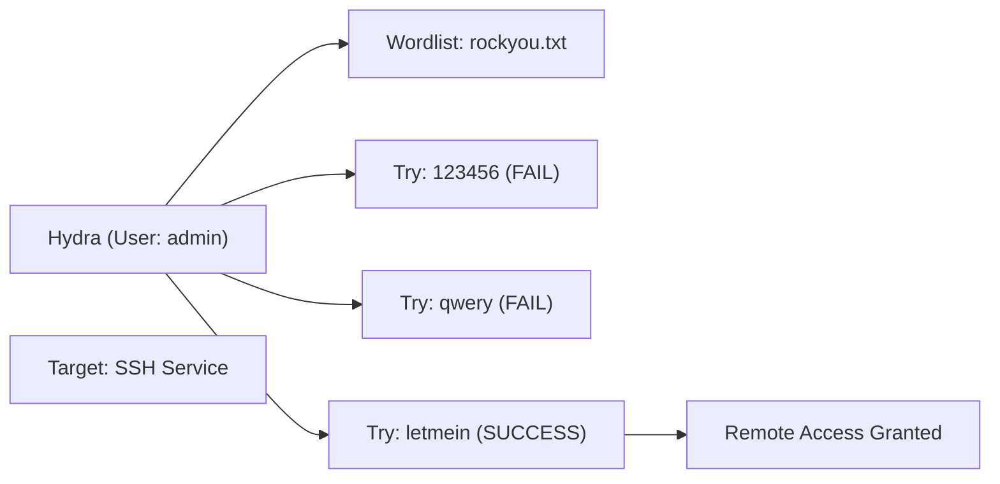

# Hydra & Brute Forcing Services

When vulnerabilities like SQLi or Exploits aren't available, hackers often turn to the most basic vulnerability: **Weak Passwords**. 

**THC-Hydra** is a very fast network logon cracker which supports numerous different protocols. It is the industry standard for performing brute-force and dictionary attacks against services like SSH, FTP, Telnet, and HTTP Forms.

---

## 1. What is Brute Forcing?

- **Brute Force**: Trying every possible combination of characters (e.g., `aaa`, `aab`, `aac`). This is slow but guaranteed to eventually find the password.
- **Dictionary Attack**: Trying a list of common passwords (e.g., `password123`, `admin`, `123456`). This is much faster.

<InfoBox type="note">
**The "RockYou" Wordlist:** Practically every hacker has a copy of `rockyou.txt`, a leaked list of 14 million real-world passwords. It is the gold standard for dictionary attacks.
</InfoBox>

---

## 2. Using Hydra for SSH

Hydra requires a target, a protocol, and a set of usernames/passwords.

<TerminalWindow cmd="hydra -l admin -P /usr/share/wordlists/rockyou.txt 10.10.10.5 ssh" output="Hydra v9.0 starting...
[22][ssh] host: 10.10.10.5   login: admin   password: password123
1 of 1 target successfully completed, 1 valid password found." />

### Common Flags:
- `-l`: A single username.
- `-L`: A file containing a list of usernames.
- `-p`: A single password.
- `-P`: A file containing a list of passwords.
- `-t 4`: Number of parallel tasks (threads). Be careful, too many can crash the service or trigger a lockout!

---

## 3. Web Form Brute Forcing

Hydra can also be used to crack web login forms. This is more complex because you have to tell Hydra how the form works.

**Attack Pattern:**
`hydra -l admin -P passwords.txt 10.10.10.5 http-post-form "/login.php:user=^USER^&pass=^PASS^:F=Login failed"`

1. **Path**: `/login.php`
2. **Parameters**: `user=^USER^&pass=^PASS^`
3. **Failure Message**: `F=Login failed` (Hydra keeps trying until this message *disappears*).

---

## 4. Visualizing the Attack

---

## Knowledge Check

<Quiz 
  question="When using Hydra to crack a web form, what does the 'F=' part of the command represent?"
  options={["Fast mode", "Force connection", "The failure message returned by the website", "The file path"]}
  answer="The failure message returned by the website"
  explanation="Hydra uses this string to determine if an attempt was unsuccessful. If the string is NOT in the server's response, Hydra assumes it found the correct password."
/>
