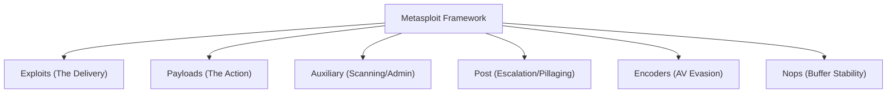

# Metasploit Framework Architecture

The **Metasploit Framework (MSF)** is the world's most used penetration testing framework. It allows you to find, exploit, and validate vulnerabilities. 

To use Metasploit effectively, you must understand its modular architecture.

---

## 1. The Modular System

Metasploit is built of hundreds of small pieces of code called **Modules**.

- **Exploits**: Code that takes advantage of a specific vulnerability (e.g., EternalBlue).
- **Payloads**: The malicious code that runs *after* the exploit succeeds (e.g., a reverse shell).
- **Auxiliary**: Tools for reconnaissance, scanning, and fuzzing (no payload needed).
- **Post**: Modules designed to run on a machine you have already compromised.

---

## 2. Using the Console (`msfconsole`)

The `msfconsole` is the main interface for interacting with the framework.

<TerminalWindow cmd="msfconsole" output="msf6 > search bluekeep
msf6 > use exploit/windows/rdp/cve_2019_0708_bluekeep_rce
msf6 exploit(bluekeep) > set RHOSTS 10.10.10.5
msf6 exploit(bluekeep) > exploit" />

---

## 3. Meterpreter (The Ultimate Payload)

**Meterpreter** is an advanced, multi-faceted payload that operates via in-memory DLL injection. It is difficult for antivirus to detect because it never touches the disk.

### Common Meterpreter Commands:
- `getuid`: See who you are running as.
- `screenshot`: Take a picture of the victim's desktop.
- `hashdump`: Dump the system's password hashes.
- `shell`: Drop down into a standard OS command shell.

<InfoBox type="note">
**Architecture Tip:** Meterpreter is "staged". First, a small "Stager" is sent to the target, which then reaches back to Metasploit to download the full "Stage" (the Meterpreter server).
</InfoBox>

---

## Knowledge Check

<Quiz 
  question="In Metasploit, what is the term for the malicious code that executes on the target after a vulnerability is exploited?"
  options={["Exploit", "Auxiliary", "Payload", "Encoder"]}
  answer="Payload"
  explanation="The Payload is the code you want to run (like a shell or a file delete) once the exploit has successfully granted you access."
/>
