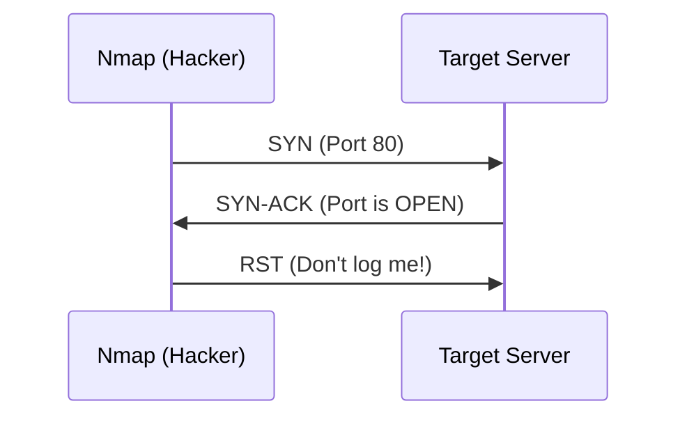

# Nmap Scanning Strategies (Stealth, Aggressive, NSE)

**Nmap (Network Mapper)** is the most important tool in a hacker's arsenal for reconnaissance. It allows you to discover hosts, open ports, and services running on a network. 

However, running Nmap blindly is a good way to get caught by a firewall or an IDS (Intrusion Detection System). You must choose your strategy wisely.

---

## 1. The Stealth Scan (`-sS`)

Also known as the **SYN Scan** or **Half-Open Scan**. 

Instead of completing the 3-Way Handshake, Nmap sends a `SYN` packet and waits for the `SYN-ACK`. Once it receives it, Nmap sends a `RST` (Reset) packet to close the connection immediately. Because the connection is never fully established, it often doesn't show up in application logs.

---

## 2. The Aggressive Scan (`-A`)

If you don't care about being quiet and want maximum information, use the aggressive flag. This is equivalent to:
- `-sV`: Version detection.
- `-sC`: Default scripts.
- `-O`: OS fingerprinting.
- `traceroute`: Map the path to the target.

<TerminalWindow cmd="nmap -A 10.10.10.5" output="PORT   STATE SERVICE VERSION
22/tcp open  ssh     OpenSSH 7.6p1
80/tcp open  http    Apache httpd 2.4.29
Device type: general purpose
Running: Linux 4.X|5.X
[!] Full Target Profile Generated" />

---

## 3. Nmap Scripting Engine (NSE)

NSE allows Nmap to go beyond simple port scanning. It can automate vulnerability detection, brute forcing, and advanced discovery.

**Example: Scanning for vulnerabilities**
<TerminalWindow cmd="nmap --script vuln 10.10.10.5" output="PORT   STATE SERVICE
80/tcp open  http
|_http-csrf: Potential CSRF vulnerability found at /login
|_http-stored-xss: Stored XSS found at /comments.php" />

---

## Scanning Speed & Timing (`-T0` to `-T5`)

- **T0 (Paranoid)**: Very slow, bypasses IDS. 
- **T3 (Normal)**: The default.
- **T5 (Insane)**: Very fast, but likely to crash the target or be blocked.

<InfoBox type="tip">
**Hacker Tip:** Always start with a simple ping sweep (`nmap -sn 10.10.10.0/24`) to see which hosts are even alive before committing to a deep scan.
</InfoBox>

---

## Knowledge Check

<Quiz 
  question="Which Nmap flag is used to perform a 'Half-Open' SYN scan for stealth?"
  options={["-sV", "-sT", "-sS", "-sU"]}
  answer="-sS"
  explanation="-sS sends a SYN and resets the connection upon receiving a SYN-ACK, avoiding full connection logging."
/>
