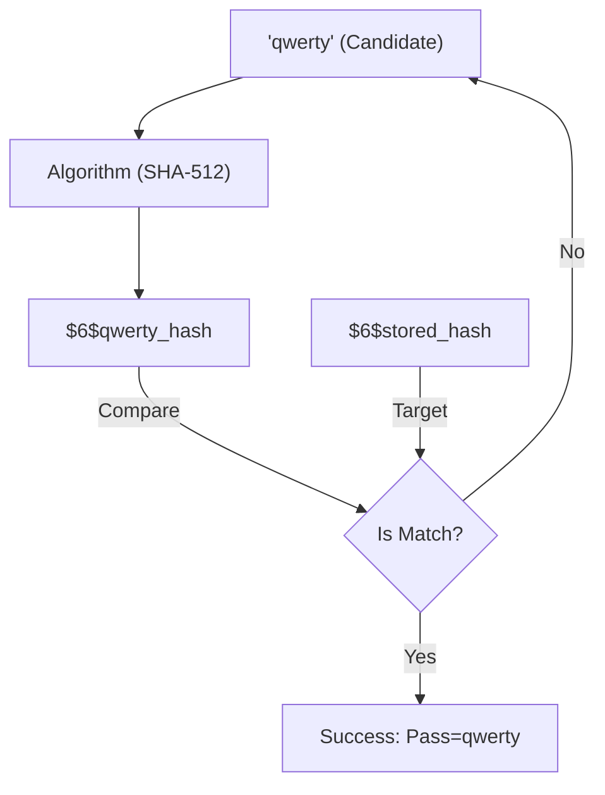

# Dumping Hashes & Cracking (John/Hashcat)

Passwords are rarely stored in cleartext on a server. Instead, they are run through a mathematical function called a **Hash**. A hash is one-way, meaning you can't easily reverse it. 

As a hacker, you don't "decrypt" a hash. You "crack" it by hashing millions of common passwords and comparing them to the hash you found.

---

## 1. Where are Hashes Stored?

### Linux
Two files are critical:
- `/etc/passwd`: Lists users (anyone can read).
- `/etc/shadow`: Stores the hashes (only root can read).

**Linux Hash Example:** `$6$somesalt$hQ8..` (`$6$` means SHA-512).

### Windows
- **SAM Database**: Local account hashes.
- **LSASS Process**: Hashes (and sometimes passwords) stored in memory.
- **Active Directory (NTDS.dit)**: All domain passwords.

---

## 2. Dumping the Hashes

Once you have root/admin access, you must "dump" the hashes to your own machine.

<TerminalWindow cmd="cat /etc/shadow | grep admin" output="admin:$6$vX9...mN8:18645:0:99999:7:::" />

On Windows, tools like **Mimikatz** or **SecretsDump** are used to extract hashes from memory or the registry.

---

## 3. Cracking with John the Ripper

John is a versatile password cracker that auto-detects hash types.

**Attack:**
<TerminalWindow cmd="john --wordlist=/usr/share/wordlists/rockyou.txt hashes.txt" output="Loaded 1 password hash (SHA-512 [64/64])
password123      (admin)
1 password hash cracked, 0 left" />

---

## 4. Cracking with Hashcat (The Speed King)

**Hashcat** is the world's fastest password cracker because it uses your **GPU** (Graphics Card) to check millions of passwords per second.

Hashcat uses "Mode" numbers for different hash types:
- `0`: MD5
- `1000`: NTLM (Windows)
- `1800`: SHA-512 (Linux)

**Attack:**
<TerminalWindow cmd="hashcat -m 1800 shadow_hashes.txt rockyou.txt" output="$6$vX9...mN8:password123
[!] Cracking Complete in 0.4 seconds" />

---

## Visualizing the Brute Force

---

## Knowledge Check

<Quiz 
  question="Which file in a Linux system stores the encrypted password hashes?"
  options={["/etc/passwd", "/etc/shadow", "/var/log/auth.log", "/etc/crypt"]}
  answer="/etc/shadow"
  explanation="/etc/shadow is restricted to root and contains the secure hashes of user passwords."
/>
