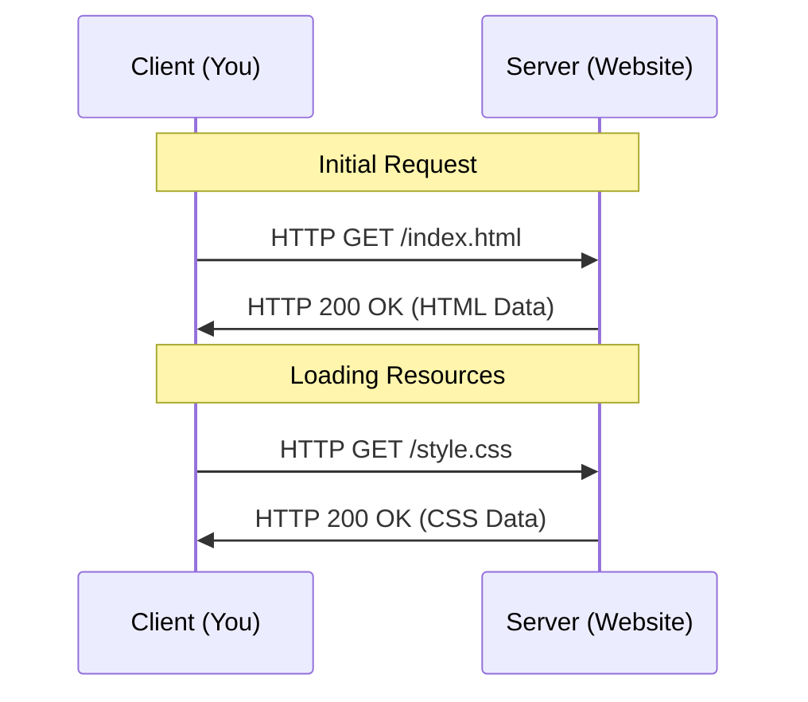

# How the Web Works (Requests/Responses)

To hack the web, you must first understand how it communicates. Every time you visit a website, a complex conversation happens between your browser (**The Client**) and a computer somewhere else in the world (**The Server**).

This conversation happens using the **HTTP (HyperText Transfer Protocol)**.

---

## The Request/Response Cycle

The web is a "Request-Response" system. The client asks for something, and the server provides it (or an error).

---

## Anatomy of an HTTP Request

When your browser sends a request, it includes several key components:

1. **Method**: What action to perform (e.g., GET, POST, PUT, DELETE).
2. **Path**: The resource you want (e.g., `/login`).
3. **Headers**: Extra information (e.g., User-Agent, Cookies).
4. **Body**: Data being sent (only for POST/PUT requests).

<TerminalWindow cmd="curl -v google.com" output="> GET / HTTP/1.1
> Host: google.com
> User-Agent: curl/7.68.0
> [!] Request Headers Sent" />

---

## Anatomy of an HTTP Response

The server replies with:

1. **Status Code**: A 3-digit number indicating the result.
2. **Headers**: Server info, Content-Type, etc.
3. **Body**: The actual HTML, Image, or JSON data.

### Common Status Codes:
- **200 OK**: Success!
- **301/302 Redirect**: The page moved.
- **403 Forbidden**: You aren't allowed here.
- **404 Not Found**: This doesn't exist.
- **500 Internal Server Error**: The server crashed.

---

## HTTP Verbs (The Actions)

| Verb | Purpose | Vulnerability Trend |
| :--- | :--- | :--- |
| **GET** | Retrieve data | Sensitive data in URL (Insecure logging) |
| **POST** | Submit data | Form manipulation, XSS |
| **PUT** | Update/Upload | Arbitrary File Upload |
| **DELETE**| Remove data | Unauthorized deletion (IDOR) |

---

## Interactive Header Analysis

Inspecting headers is the first step in web penetration testing.

<PacketView src="192.168.1.5" dst="93.184.216.34" flags="POST /api/login" data="username=admin&password=password123" />
<InfoBox type="warning">
**Security Risk:** Notice that the password is being sent in plain text in the request body. If HTTPS were not used, a hacker on the network could steal it.
</InfoBox>

---

## Knowledge Check

<Quiz 
  question="Which HTTP status code indicates that a resource was not found on the server?"
  options={["200", "302", "403", "404"]}
  answer="404"
  explanation="404 Not Found is the standard response when the server cannot find the requested resource."
/>
