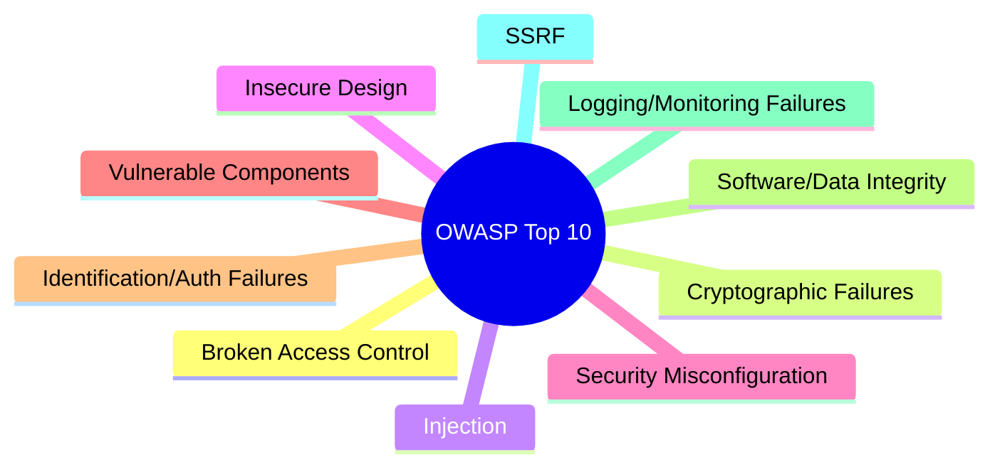

# OWASP Top 10 Overview

The **OWASP (Open Worldwide Application Security Project)** Top 10 is a standard awareness document for developers and web security professionals. It represents a broad consensus on the most critical security risks to web applications.

As a penetration tester, this is your primary reference for what to look for during an engagement.

---

## The 2021 Categories

The OWASP list evolves to reflect the modern threat landscape. Here is the current landscape:

### 1. Broken Access Control (A01)
The most common risk. This occurs when users can access data or functions outside of their intended permissions (e.g., viewing another user's profile by changing an ID in the URL).

### 2. Cryptographic Failures (A02)
Failures related to encryption (or lack thereof). This involves transmitting sensitive data in cleartext or using weak algorithms.

### 3. Injection (A03)
This includes **SQL Injection**, **Command Injection**, and **LDAP Injection**. It happens when untrusted data is sent to an interpreter as part of a command or query.

### 4. Insecure Design (A04)
A new category focusing on risks related to design flaws. Even a perfectly written script is vulnerable if the underlying design is insecure.

### 5. Security Misconfiguration (A05)
Common when developers leave default settings, open cloud buckets, or verbose error messages that reveal system information.

---

## The Impact of a Vulnerability

A single vulnerability can lead to a complete system compromise. 

<InfoBox type="note">
**Example:** A "Security Misconfiguration" might reveal the database version, which allows an "Injection" attack, leading to "Broken Access Control" where the hacker steals all user data.
</InfoBox>

---

## Real-world Simulation

Let's look at a server error message that is a classic "Security Misconfiguration".

<TerminalWindow cmd="curl -X POST http://target.com/api/user" output="{
  'error': 'Internal Server Error',
  'debug': 'SQL Query Failed: SELECT * FROM users WHERE id = null',
  'version': 'MySQL 8.0.23',
  'path': '/var/www/html/api/db_connect.php'
}
[!] Information Leakage Detected!" />

---

## Knowledge Check

<Quiz 
  question="Which OWASP category involves users accessing data that should be restricted to them?"
  options={["Security Misconfiguration", "Broken Access Control", "Injection", "SSRF"]}
  answer="Broken Access Control"
  explanation="Broken Access Control refers to flaws where users can act outside of their intended permissions."
/>
