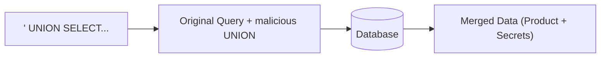

# SQL Injection (Union Based & Boolean Blind)

**SQL Injection (SQLi)** occurs when an attacker can interfere with the queries that an application makes to its database. It allows attackers to view data they are not normally able to retrieve, and in some cases, modify or delete this data.

---

## 1. How SQLi Works

Most web applications use a database to store users, products, and comments. When you search for a product, the application might run a query like this:

`SELECT * FROM products WHERE id = '`**[USER_INPUT]**`';`

If the application doesn't sanitize the input, an attacker can "break out" of the quote.

**Attack Payload:** `1' OR 1=1 --`
**Resulting Query:** `SELECT * FROM products WHERE id = '1' OR 1=1 --';`

The `--` is a comment in SQL, so everything after it is ignored. Since `1=1` is always true, the database returns **every** product!

---

## 2. Union-Based SQLi

The `UNION` operator is used to combine the results of two or more `SELECT` statements. A hacker can use this to pull data from a completely different table (like the `users` table).

**Steps:**
1. **Find the number of columns:** `1' ORDER BY 1--`, `1' ORDER BY 2--`... until it errors.
2. **Retrieve data:** `1' UNION SELECT 1,username,password FROM users--`

---

## 3. Blind SQLi (Boolean Based)

Sometimes the application doesn't show the database results on the screen. Instead, it might just say "User Found" or "User Not Found". This is **Blind SQLi**.

We can ask the database **Yes/No** questions and observe the response.

**Attack:** `' OR (SELECT SUBSTRING(password,1,1) FROM users WHERE username='admin')='a'--`
- If the response is "User Found", we know the first letter of the password is 'a'.
- If "Not Found", we try 'b', 'c', etc.

---

## Interactive Lab Simulation

Try to break the query using a tactical quote.

<TerminalWindow cmd="curl http://target.com/search?id=1'" output="Internal Server Error: You have an error in your SQL syntax near ''' at line 1.
[!] Database Error Leaked: SQL Injection Potential High!" />

---

## Knowledge Check

<Quiz 
  question="Which SQL character is commonly used to comment out the rest of a query after an injection?"
  options={[";", "--", "/*", "Both -- and /*"]}
  answer="Both -- and /*"
  explanation="In most SQL dialects (MySQL, PostgreSQL, etc.), -- is a line comment and /* */ is a block comment."
/>
