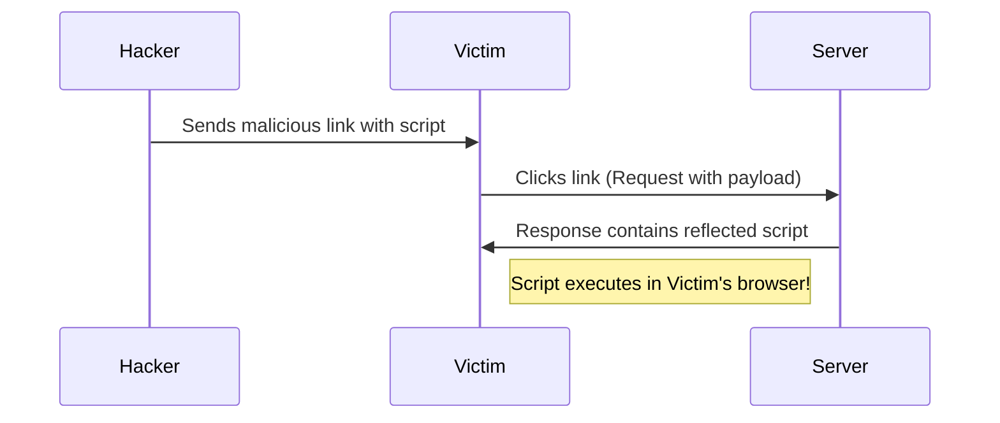

# HTML Injection & XSS (Reflected vs Stored)

**Cross-Site Scripting (XSS)** is a type of injection attack where malicious scripts are injected into otherwise benign and trusted websites. XSS happens when an application includes untrusted data in a new web page without proper validation or escaping.

---

## 1. HTML Injection

The simplest form of XSS. If a website takes user input (like a name) and puts it directly into the HTML without filtering, you can try to inject HTML tags.

**Vulnerable Code:**
`
Welcome, <?php echo $_GET['name']; ?>!
`

**Attack:**
`?name=<h1>Hacked</h1>`

---

## 2. Reflected XSS

In a Reflected attack, the malicious script is "reflected" off the web server to the victim's browser. It is usually delivered via a link (e.g., in an email or chat).

---

## 3. Stored XSS

The most dangerous type. The script is permanently stored on the target server (e.g., in a database, in a comment field, or a user profile). Every user who views that page will execute the script.

<InfoBox type="warning">
**Impact:** A hacker could use Stored XSS on a popular forum to steal the session cookies of thousands of users automatically.
</InfoBox>

---

## Technical Payloads

The goal of XSS is usually to execute JavaScript.

- **Basic Alert:** ``
- **Cookie Stealer:** ``
- **Image Bypass:** `` (Uses an invalid image source to trigger an error handler).

---

## Interactive Lab Simulation

Try to inject a script into the search bar simulation.

<TerminalWindow cmd="search.php?q=" output="Searching for: ...
[!] XSS Payload Executed in Console!" />

---

## Knowledge Check

<Quiz 
  question="What is the main difference between Reflected and Stored XSS?"
  options={[
    "Reflected XSS is more dangerous",
    "Stored XSS is saved on the server's database",
    "Reflected XSS only works on mobile",
    "Stored XSS doesn't use JavaScript"
  ]}
  answer="Stored XSS is saved on the server's database"
  explanation="Stored XSS is persistent because the payload is saved on the server and served to all users."
/>
