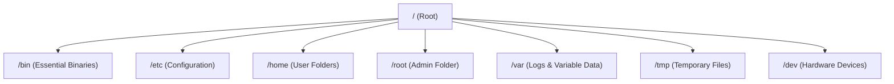

# Linux Directory Structure & Permissions

In Linux, "Everything is a file". This is a core philosophy that makes Linux powerful and flexible. To navigate it effectively, you must understand where things are stored and who is allowed to touch them.

---

## The Filesystem Hierarchy (FHS)

Unlike Windows, Linux doesn't have "C:" or "D:" drives. Everything starts from the **Root** directory, represented by a single forward slash: `/`.

### Key Directories for Hackers:
- **/etc**: Contains system configuration files (like `/etc/shadow` which stores password hashes).
- **/tmp**: A world-writable directory. Often used to upload tools or scripts during an exploit.
- **/bin & /usr/bin**: Where your commands (ls, cat, nmap) live.
- **/var/log**: Where the system logs your activity. A smart hacker knows how to clean these.

---

## Understanding Permissions

Linux is a multi-user system, so security is handled via permissions. Every file or directory has an **Owner**, a **Group**, and **Others**.

<TerminalWindow cmd="ls -l /etc/passwd" output="-rw-r--r-- 1 root root 1827 Jan 10 12:00 /etc/passwd" />

### The Permission String: `-rw-r--r--`
1. **Type**: `-` (File) or `d` (Directory).
2. **Owner (rwx)**: `rw-` (Read & Write).
3. **Group (r--)**: `r--` (Read only).
4. **Others (r--)**: `r--` (Read only).

### Numerical Representation (Chmod)
- **4**: Read (r)
- **2**: Write (w)
- **1**: Execute (x)
- **0**: None

**Example:** `chmod 755 script.sh`
- `7` (4+2+1) = rwx for Owner.
- `5` (4+1) = r-x for Group.
- `5` (4+1) = r-x for Others.

---

## SUID Bits: The Hacker's Favorite

<InfoBox type="warning">
An **SUID (Set User ID)** permission allows a file to be executed with the permissions of the file's owner (often **root**) rather than the user running it. If a file like `cp` or `find` has the SUID bit set, it can be used for Privilege Escalation.
</InfoBox>

---

## Knowledge Check

<Quiz 
  question="If a file has the permissions 'rwx-r-x-r-x', what is its numerical chmod representation?"
  options={["644", "755", "777", "711"]}
  answer="755"
  explanation="rwx = 7, r-x = 5, r-x = 5. Therefore, the total is 755."
/>
