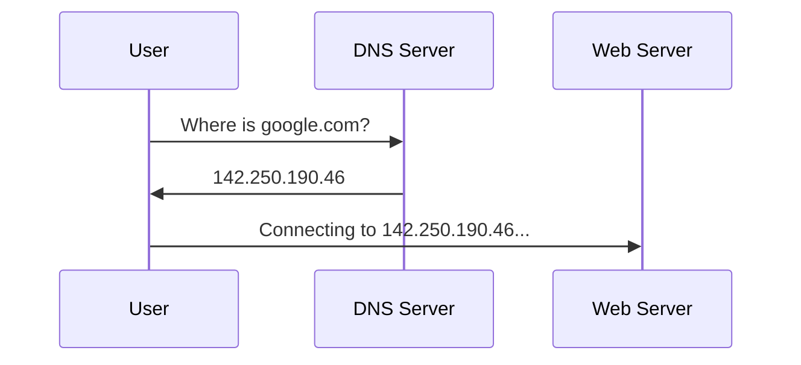

# Common Protocols (DNS, HTTP, FTP, SSH)

A **Protocol** is simply a set of rules for how data is transmitted. Just as humans use different languages for different purposes, computers use different protocols depending on the task.

As a hacker, understanding these protocols is essential because each one has its own common vulnerabilities.

---

## 1. DNS (Domain Name System)
**Port: 53 (UDP/TCP)**  
DNS is the "Phonebook of the Internet". It translates human-friendly names (google.com) into machine-friendly IP addresses (142.250.190.46).

---

## 2. HTTP/HTTPS (HyperText Transfer Protocol)
**Port: 80 (HTTP) / 443 (HTTPS)**  
The foundation of the World Wide Web. HTTP is used to request and send web pages. HTTPS is the secure version, using **TLS/SSL** to encrypt the traffic.

<PacketView src="Client" dst="Server" flags="GET /" data="Host: antigravity.hub..." />

---

## 3. FTP (File Transfer Protocol)
**Port: 21 (Control) / 20 (Data)**  
Used for transferring files between a client and a server. **Crucial for hackers:** Standard FTP sends passwords in **Plaintext**. If you are on the same network, you can sniff the credentials.

<TerminalWindow cmd="ftp 10.10.10.5" output="Connected to 10.10.10.5.
Name: anonymous
[!] Anonymous login successful." />

---

## 4. SSH (Secure Shell)
**Port: 22 (TCP)**  
The secure way to remotely manage a computer. Unlike the older **Telnet** (Port 23), SSH encrypts all traffic, making it the industry standard for server administration.

---

## Common Port Checklist

| Protocol | Port | Description |
| :--- | :--- | :--- |
| **SSH** | 22 | Secure Remote Access |
| **DNS** | 53 | Domain Translation |
| **HTTP** | 80 | Web Traffic (Unsecured) |
| **HTTPS** | 443 | Web Traffic (Secured) |
| **SMB** | 445 | Windows File Sharing |
| **RDP** | 3389 | Remote Desktop |

---

## Knowledge Check

<Quiz 
  question="Which protocol is used to securely manage a remote server and operates on port 22 by default?"
  options={["Telnet", "FTP", "SSH", "HTTP"]}
  answer="SSH"
  explanation="SSH (Secure Shell) provides a secure, encrypted channel for remote administration over port 22."
/>
