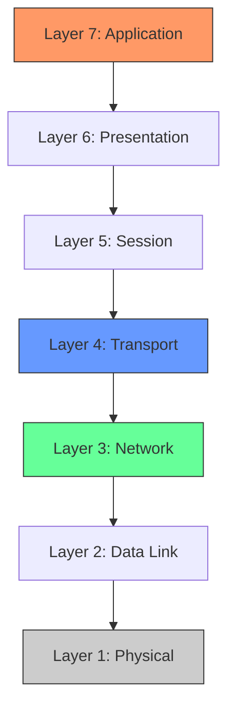

# What is Networking? (OSI Model Deep Dive)

Networking is the backbone of the digital world. It is the practice of connecting computers to share resources and communicate. To understand how data moves from your screen across the world and onto another, we use the **OSI (Open Systems Interconnection) Model**.

<InfoBox type="note">
The OSI Model is a conceptual framework used to understand network interactions in seven distinct layers. While the modern internet uses the simpler TCP/IP model, the OSI Model remains the industry standard for learning and troubleshooting.
</InfoBox>

## The 7 Layers of OSI

Data flows from the **Application Layer** (Layer 7) down to the **Physical Layer** (Layer 1) when sending, and the reverse when receiving.

### Layer 7: Application
This is where the user interacts with the network. Applications like web browsers (Chrome, Firefox) and email clients operate here using protocols like **HTTP**, **FTP**, and **SMTP**.

### Layer 6: Presentation
This layer ensures that data is in a usable format. It handles **encryption**, **compression**, and **translation** (e.g., ASCII to EBCDIC).

### Layer 5: Session
The Session layer manages checkpoints and maintains the connection between devices. It is responsible for opening, closing, and managing sessions.

### Layer 4: Transport
This layer handles error correction and flow control. The two main protocols here are:
- **TCP (Transmission Control Protocol)**: Reliable, connection-oriented (guarantees delivery).
- **UDP (User Datagram Protocol)**: Fast, connectionless (no guarantee).

### Layer 3: Network
The "Routing" layer. This is where **IP Addresses** live. Routers operate at this layer to determine the best path for data to travel across different networks.

### Layer 2: Data Link
This layer provides node-to-node data transfer. It is where **MAC Addresses** live. Switches operate at this layer.

### Layer 1: Physical
The raw bit stream. This involves the actual physical hardware, such as cables (Ethernet, Fiber), radio waves (Wi-Fi), and hubs.

---

## Encapsulation & Decapsulation

When you send a message, your data is "wrapped" in headers at each layer. This process is called **Encapsulation**.

<PacketView src="192.168.1.10" dst="8.8.8.8" flags="SYN" data="GET / HTTP/1.1" />

1. **Layer 4**: Adds a TCP header (Port numbers). Data is now a **Segment**.
2. **Layer 3**: Adds an IP header (IP addresses). Data is now a **Packet**.
3. **Layer 2**: Adds a MAC header. Data is now a **Frame**.
4. **Layer 1**: Transmits the data as **Bits**.

On the receiving end, the process is reversed (**Decapsulation**) as each layer "unwraps" its corresponding header.

---

## Interactive Simulation

Try to identify the protocol layer in the terminal simulation below.

<TerminalWindow cmd="curl -I google.com" output="HTTP/1.1 200 OK
Content-Type: text/html
...
[!] Layer 7 Interaction Detected (HTTP)" />

---

## Knowledge Check

<Quiz 
  question="Which layer is responsible for routing packets across different networks using IP addresses?"
  options={["Layer 2 (Data Link)", "Layer 3 (Network)", "Layer 4 (Transport)", "Layer 7 (Application)"]}
  answer="Layer 3 (Network)"
  explanation="Layer 3 uses IP addresses and routing protocols to move data between networks."
/>
