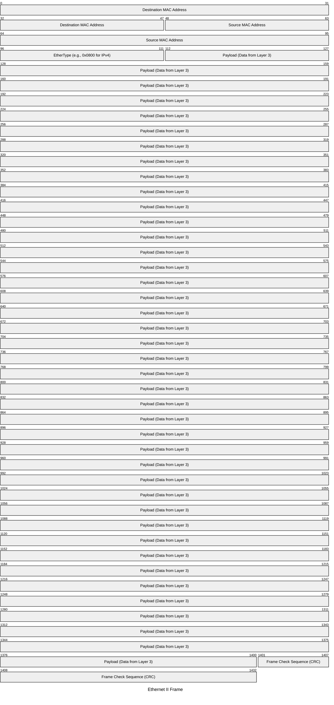

# Packets & Frames (Headers Analysis)

When data travels across a network, it is broken down into smaller pieces. These pieces are not just raw data; they are wrapped in **Headers** that provide crucial routing and handling information. 

Depending on which OSI layer the data is at, it has a different name (PDU - Protocol Data Unit):
- **Layer 4**: Segment (TCP) / Datagram (UDP)
- **Layer 3**: Packet (IP)
- **Layer 2**: Frame (Ethernet)

---

## Anatomy of an Ethernet Frame (Layer 2)

An Ethernet frame is the data unit for your local network (LAN). It uses **MAC Addresses** to move data between devices on the same physical link.

<InfoBox type="tip">
The **MAC Address** is a unique hardware identifier burned into your Network Interface Card (NIC).
</InfoBox>

---

## Anatomy of an IP Packet (Layer 3)

Once a frame leaves your local network, it becomes an IP Packet. This is where **Routing** happens using IP Addresses.

### Key IPv4 Header Fields:
- **Source IP**: Where the packet is coming from.
- **Destination IP**: Where the packet is going.
- **TTL (Time to Live)**: A counter that decrements at every router. If it hits 0, the packet is dropped (prevents infinite loops).
- **Version**: Usually 4 or 6.

<PacketView src="10.10.10.5" dst="172.16.0.1" flags="TTL: 64" data="IP Header analysis..." />

---

## Header Analysis in Action

We can use tools like `tcpdump` or Wireshark to inspect these headers in real-time.

<TerminalWindow cmd="tcpdump -i eth0 -nn -c 1 icmp" output="12:00:01.123 IP 192.168.1.5 > 8.8.8.8: ICMP echo request, id 1, seq 1, length 64
[!] Source IP: 192.168.1.5
[!] Destination IP: 8.8.8.8" />

---

## Knowledge Check

<Quiz 
  question="Which field in the IP header prevents a packet from circling the network forever?"
  options={["Checksum", "EtherType", "TTL (Time to Live)", "Fragment Offset"]}
  answer="TTL (Time to Live)"
  explanation="TTL is decremented by each router. When it reaches zero, the packet is discarded, preventing routing loops."
/>
