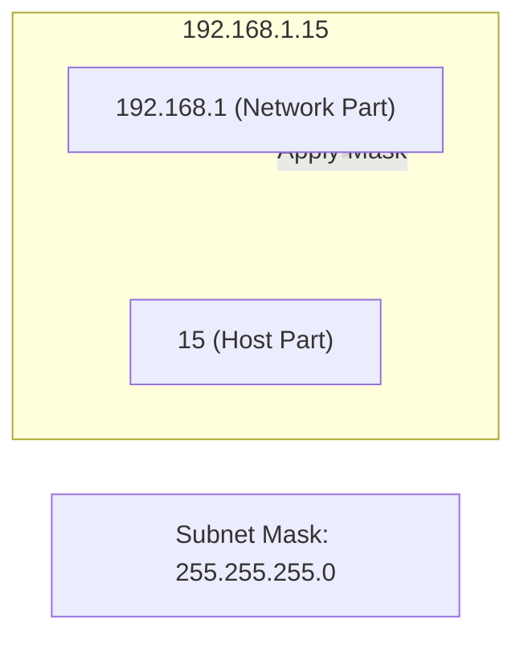

# Subnetting & CIDR Notation

IP addresses are like street addresses, but a network can have thousands of devices. **Subnetting** is the process of dividing a large network into smaller, manageable sub-networks (subnets).

This improves security, reduces congestion, and makes efficient use of limited IP addresses.

---

## Understanding the Binary

An IPv4 address consists of 32 bits, divided into 4 octets. 
Example: `192.168.1.1` -> `11000000.10101000.00000001.00000001`

A **Subnet Mask** tells the computer which part of the address belongs to the **Network** and which part belongs to the **Host**.

---

## CIDR Notation (The Slash)

Writing out `255.255.255.0` is tedious. Instead, we use **CIDR (Classless Inter-Domain Routing)** notation, which just counts the number of `1` bits in the mask.

- `/24` = `255.255.255.0` (24 bits for the network). Matches `192.168.1.*`
- `/16` = `255.255.0.0` (16 bits for the network). Matches `192.168.*.*`
- `/8` = `255.0.0.0` (8 bits for the network). Matches `10.*.*.*`

<InfoBox type="warning">
The smaller the CIDR number, the larger the network (more hosts). The larger the CIDR number, the smaller the network (fewer hosts).
</InfoBox>

---

## Common Private Ranges

To prevent the world from running out of IPs, certain ranges are reserved for private home/office networks:
- `10.0.0.0/8` (Largest)
- `172.16.0.0/12`
- `192.168.0.0/16` (Most common for homes)

---

## Interactive Calculation

Let's look at a typical network configuration.

<TerminalWindow cmd="ip addr show eth0" output="inet 192.168.1.50/24 brd 192.168.1.255 scope global
[!] Network: 192.168.1.0
[!] Mask: 255.255.255.0
[!] Broadcast: 192.168.1.255" />

---

## Knowledge Check

<Quiz 
  question="How many bits are used for the network part in an IP address with a /16 CIDR suffix?"
  options={["8", "16", "24", "32"]}
  answer="16"
  explanation="In CIDR notation, the number after the slash indicates how many bits are dedicated to identifying the network."
/>
