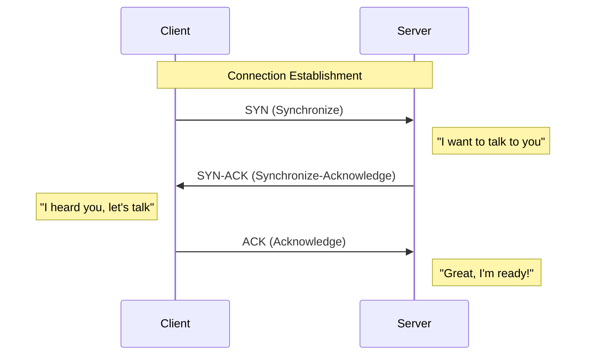

# TCP/IP & The 3-Way Handshake

The Internet runs on **TCP/IP**. While the OSI Model is great for learning, the TCP/IP model is what is actually implemented in your operating system's network stack.

One of the most critical concepts in networking is how two computers establish a reliable connection. This is done via the **TCP 3-Way Handshake**.

---

## The Handshake Process

Before any data (like a web page) is sent via TCP, the client and server must "agree" to communicate.

1. **SYN**: The client sends a packet with the `SYN` flag set and a random sequence number.
2. **SYN-ACK**: The server responds with its own `SYN` flag and an `ACK` flag, acknowledging the client's sequence number.
3. **ACK**: The client sends a final `ACK` to confirm the connection is established.

---

## TCP vs UDP: The Great Debate

<InfoBox type="note">
**TCP** is like a phone call (You confirm the other person is there before talking). **UDP** is like a letter (You send it and hope it arrives).
</InfoBox>

| Feature | TCP (Transmission Control) | UDP (User Datagram) |
| :--- | :--- | :--- |
| **Connection** | Connection-Oriented | Connectionless |
| **Reliability** | Guranteed Delivery | Best-effort (No guarantee) |
| **Speed** | Slower (overhead) | Fast (minimal overhead) |
| **Example** | HTTP, SSH, Email | Gaming, Streaming, DNS |

---

## Packet Inspection

We can see these flags in action using `nmap` or `tcpdump`. A "SYN Scan" is the most common technique hackers use to find open ports without completing the full handshake.

<TerminalWindow cmd="nmap -sS -p 80 10.10.10.1" output="Starting Nmap...
PORT   STATE SERVICE
80/tcp open  http
[!] SYN sent -> SYN-ACK received. Port is OPEN." />

---

## Knowledge Check

<Quiz 
  question="What is the correct sequence of flags sent during a TCP handshake?"
  options={["SYN, ACK, SYN-ACK", "SYN, SYN-ACK, ACK", "ACK, SYN, SYN-ACK", "PING, PONG, ACK"]}
  answer="SYN, SYN-ACK, ACK"
  explanation="The handshake follows the SYN (Client), SYN-ACK (Server), and ACK (Client) sequence to establish a reliable connection."
/>
