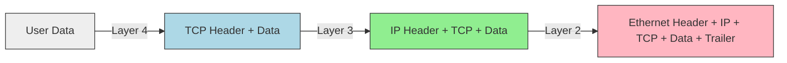

# The OSI Model Deep Dive

You saw the basics in Pre-Security. Now we analyze the headers added at each layer.
This process is called **Encapsulation**.

## Encapsulation Visualization

As data moves **down** the stack, it gets wrapped in headers.

When it reaches the destination, the process reverses (**Decapsulation**).

## Why This Matters

Firewalls often filter based on Layer 3 (IP) or Layer 4 (Port).
Deep Packet Inspection (DPI) looks at Layer 7.

If you encrypt your payload (HTTPS), the firewall can't see Layer 7. It can only see Layer 3/4.
This is why malware uses HTTPS to call home—to hide in plain sight.

## Layer-Specific Headers

*   **Layer 2 (Ethernet):** Source MAC, Dest MAC.
*   **Layer 3 (IP):** Source IP, Dest IP, TTL.
*   **Layer 4 (TCP):** Source Port, Dest Port, Seq Number, Ack Number.

<Quiz 
  question="Which process adds headers to data as it moves down the stack?"
  options={[
    "Decapsulation",
    "Encapsulation",
    "Fragmentation",
    "Segmentation"
  ]}
/>
