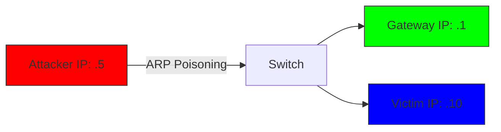

# ICMP & ARP

These are utility protocols. They don't carry user data, they keep the network running.

## ICMP (Internet Control Message Protocol)
*   **Purpose:** Diagnostics and status reporting.
*   **The Tool:** `ping` uses ICMP Echo Request/Reply.
*   **Attack:** ICMP Tunneling (hiding data in ping packets).

## ARP (Address Resolution Protocol)
*   **Purpose:** Mapping Logical Addresses (IP) to Physical Addresses (MAC).
*   **The Flow:** "Who has 192.168.1.1? Tell 192.168.1.5."
*   **Attack:** ARP Poisoning (Man-in-the-Middle).

## The Local Network Map

By telling the victim "I am the Gateway" and telling the Gateway "I am the Victim", the attacker intercepts all traffic.

## Lab: ARP Cache

Check the ARP cache on a compromised machine to see who it has been talking to.

<TerminalWindow 
  cmd="arp -a" 
  output="Interface: 192.168.1.5 --- 0x2
Internet Address      Physical Address      Type
192.168.1.1           00-50-56-c0-00-08     dynamic
192.168.1.254         de-ad-be-ef-ca-fe     dynamic

# Hidden comment in cache entry: BL{ARP_P0is0n_D3t3ct3d}" 
/>

The MAC address `de-ad-be-ef-ca-fe` looks suspicious.

<Quiz 
  question="Which protocol resolves IP addresses to MAC addresses?"
  options={[
    "ARP",
    "DNS",
    "DHCP",
    "ICMP"
  ]}
/>

<Quiz 
  question="What is the hidden flag in the ARP cache?"
  options={[
    "BL{ARP_P0is0n_D3t3ct3d}",
    "BL{M1tM_Att4ck}",
    "de-ad-be-ef-ca-fe",
    "BL{ICMP_Tunn3l}"
  ]}
/>
