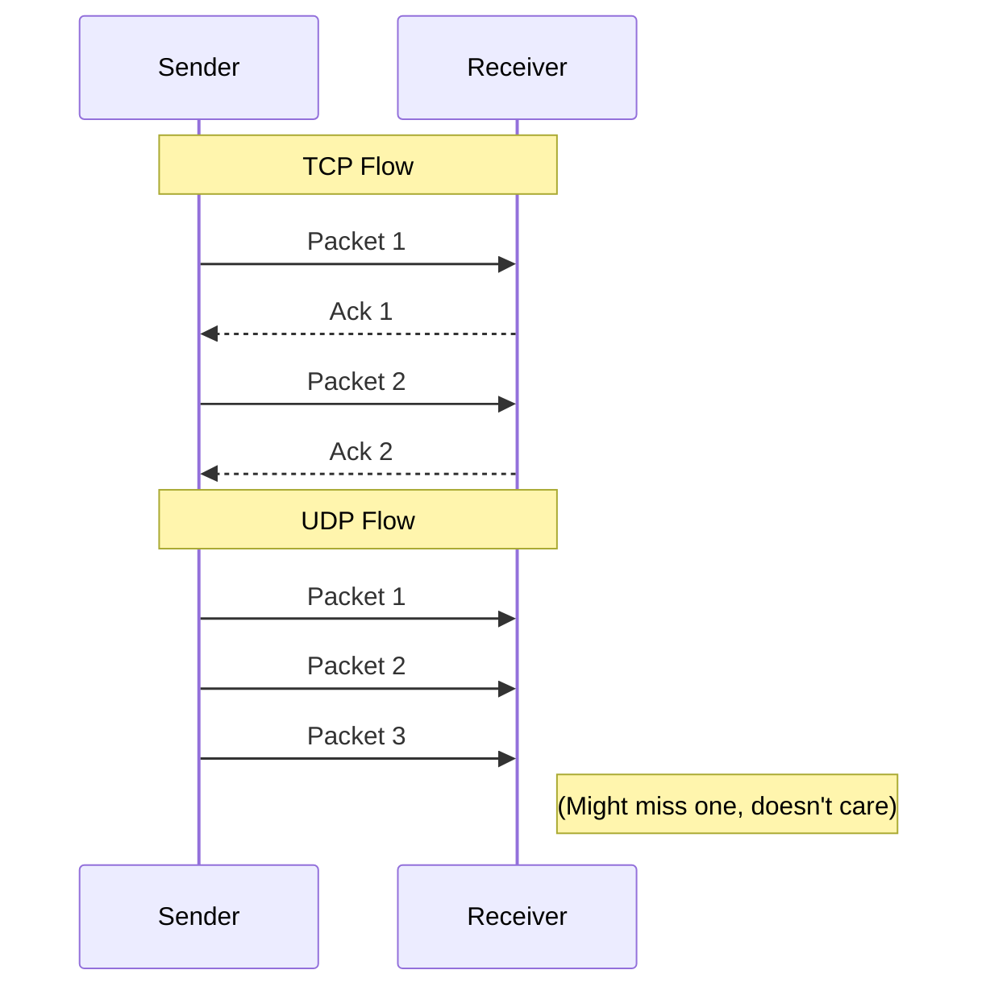

# TCP & UDP

Layer 4 (Transport) has two main champions.

## TCP (Transmission Control Protocol)
*   **Reliable:** Guarantees delivery. Resends lost packets.
*   **Ordered:** Packets arrive in order.
*   **Heavy:** Slower due to handshake and overhead.
*   **Use Cases:** Web (HTTP), Email (SMTP), File Transfer (FTP).

## UDP (User Datagram Protocol)
*   **Unreliable:** Fire and forget. No guarantee it arrives.
*   **Fast:** No handshake. Low latency.
*   **Use Cases:** Streaming, VOIP, DNS, Gaming.

## Visualizing the Difference

## Lab: Service Identification

You are scanning a host. Which services are running?

<TerminalWindow 
  cmd="nmap -sU -sT -p 53,80 10.10.10.5" 
  output="PORT   STATE SERVICE
53/udp open  domain
80/tcp open  http
MAC Address: 00:0C:29:1A:2B:3C (VMware)

Scan completed. Flag hidden in banner: BL{TCP_RvS_UDP_KnoWl3dg3}" 
/>

DNS (Port 53) often runs on UDP for speed, while HTTP (Port 80) needs TCP for reliability.

<Quiz 
  question="Which protocol would you use for a live video stream?"
  options={[
    "UDP",
    "TCP",
    "ICMP",
    "FTP"
  ]}
/>

<Quiz 
  question="What is the flag found in the scan results?"
  options={[
    "BL{TCP_RvS_UDP_KnoWl3dg3}",
    "BL{DNS_1s_UDP}",
    "BL{Nmap_Mast3r}",
    "domain"
  ]}
/>
