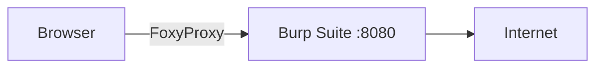

# Lab Setup Guide

For this track, the generic tools aren't enough. You need the **Pentester's Arsenal**.

## 1. Burp Suite (The Proxy)

The most important tool for Web Application Pentesting.
It sits between your browser and the server, letting you pause, modify, and replay requests.

*   **Intercept Mode:** Stops the request so you can edit it.
*   **Repeater:** Send the same request multiple times with tweaks.
*   **Intruder:** Fuzzing and brute-forcing.

## 2. Metasploit Framework

The framework for exploitation.
*   **Exploits:** Code that triggers the vulnerability.
*   **Payloads:** Code that runs *after* the exploit (e.g., Reverse Shell).

<TerminalWindow 
  cmd="msfconsole -q" 
  output="msf6 > search vsftpd
Matching Modules
================
1  exploit/unix/ftp/vsftpd_234_backdoor  2011-07-03  excellent  VSFTPD v2.3.4 Backdoor" 
/>

## 3. Wordlists (SecLists)
You cannot guess passwords. You crack them using lists.
We use **SecLists**.
Location: `/usr/share/seclists/`

## Configuration Task

Ensure you have **FoxyProxy** installed in your browser to switch traffic to Burp Suite easily.

<Quiz 
  question="Which Burp Suite tool is used for manually modifying and resending requests?"
  options={[
    "Intruder",
    "Repeater",
    "Decoder",
    "Scanner"
  ]}
/>

<Quiz 
  question="Where are wordlists typically stored in Kali Linux?"
  options={[
    "/var/www/html",
    "/usr/share/wordlists",
    "/etc/password",
    "/tmp"
  ]}
/>
