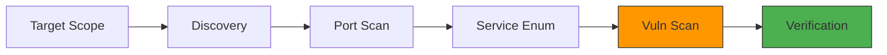

# Scanning Theory

Scanning is the bridge between Reconnaissance and Exploitation.
It's about asking the target specific questions to find weak spots.

## Types of Scans

1.  **Discovery Scan:** Is the host alive? (Ping sweep).
2.  **Port Scan:** What doors are open? (TCP/UDP).
3.  **Vulnerability Scan:** Are the locks broken? (CVE checking).

## False Positives vs. False Negatives

*   **False Positive:** Scanner says it's vulnerable, but it's not. (Annoying).
*   **False Negative:** Scanner says it's safe, but it's vulnerable. (Dangerous).

> [!TIP]
> **Never** trust a scanner blindly. Always verify manually.

## The Scanning Lifecycle

## Lab: Identifying the Scan Type

You see a log entry:
`GET /cgi-bin/test-cgi?user=Example`
`GET /scripts/..%c0%af../winnt/system32/cmd.exe`

Is this a Port Scan or a Vuln Scan?
It's looking for specific exploits (Shellshock, Path Traversal). It's a Vuln Scan.

<Quiz 
  question="What is it called when a scanner fails to report an existing vulnerability?"
  options={[
    "False Positive",
    "False Negative",
    "True Negative",
    "System Error"
  ]}
/>

<Quiz 
  question="Which tool is best suited for automated Vulnerability Scanning?"
  options={[
    "Nmap",
    "Nessus",
    "Wireshark",
    "Netcat"
  ]}
/>
