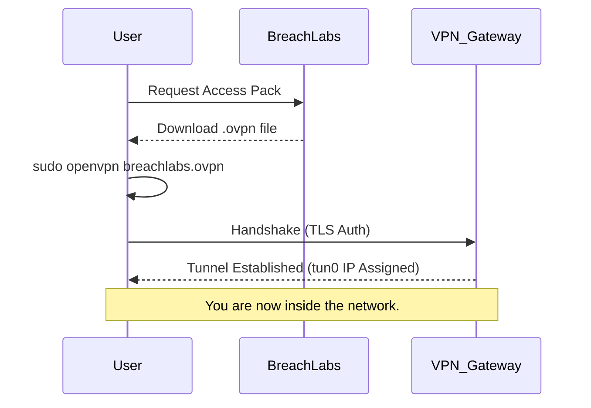

# Lab Setup

  <i className="fas fa-info-circle me-2"></i>
  <strong>Objective:</strong> Establish a secure connection to the BreachLabs infrastructure and initialize your attack machine.

## Connection Options

You have two primary ways to access our labs:

### 1. The AttackBox (Browser-Based)
The easiest way to start. We spin up a fully configured Kali Linux instance directly in your browser. No installation required.

*   **Pros:** Instant access, no resource usage on your PC.
*   **Cons:** Session resets after 1 hour of inactivity.

### 2. OpenVPN (Local VM)
For power users. Connect your own local Kali Linux VM to our network using OpenVPN.

*   **Pros:** Persistent storage, use your own customized tools.
*   **Cons:** Requires setup and installation.

## Configuration Flow

## Verifying Connectivity

Once connected, you verify your access by pinging the **Gateway** at `10.10.10.1`.

<TerminalWindow 
  cmd="ping -c 4 10.10.10.1" 
  output="PING 10.10.10.1 (10.10.10.1) 56(84) bytes of data.
64 bytes from 10.10.10.1: icmp_seq=1 ttl=64 time=24.5 ms
64 bytes from 10.10.10.1: icmp_seq=2 ttl=64 time=23.8 ms
64 bytes from 10.10.10.1: icmp_seq=3 ttl=64 time=25.1 ms
64 bytes from 10.10.10.1: icmp_seq=4 ttl=64 time=24.2 ms

--- 10.10.10.1 ping statistics ---
4 packets transmitted, 4 received, 0% packet loss, time 3005ms" 
/>

If you see `0% packet loss`, you are Green across the board.

## Troubleshooting

> [!TIP]
> If the ping hangs, check your firewall settings and ensure you are running OpenVPN with **sudo** privileges.

<Quiz 
  question="Which connection method allows you to use your own local tools persistent across sessions?"
  options={[
    "The AttackBox",
    "OpenVPN Connection",
    "Direct TCP/IP",
    "HTTP Proxy"
  ]}
/>
