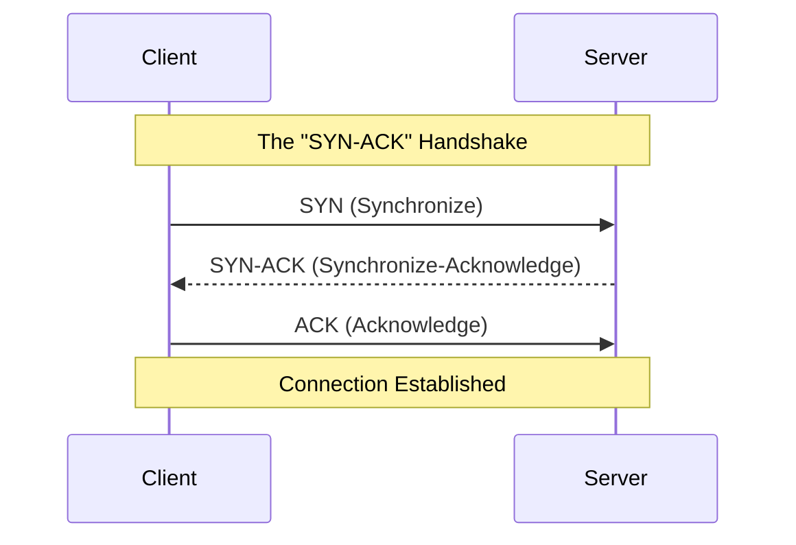

# TCP/IP Protocol

While the OSI model is accurate for theory, the internet actually runs on the **TCP/IP** stack.
It groups the OSI layers into a simpler 4-layer model.

## The TCP/IP Suite

1.  **Application Layer** (Represents OSI Session, Presentation, Application)
2.  **Transport Layer** (TCP, UDP)
3.  **Internet Layer** (IP, ICMP)
4.  **Network Interface** (Physical, Data Link)

## The Three-Way Handshake

Protocol for establishing a reliable connection (TCP). This is critical for understanding network scans (Nmap).

If you send a `SYN` and never send the final `ACK`, the server waits. Do this enough times, and you crash the server (SYN Flood).

## Hands-On: Packet Analysis

We have captured a packet snippet. Analyze it to find the hidden data.

<TerminalWindow 
  cmd="tshark -r capture.pcap" 
  output="1 0.000000 192.168.1.5 -> 192.168.1.1 TCP 66 54321 > 80 [SYN] Seq=0 Win=64240 Len=0
2 0.000200 192.168.1.1 -> 192.168.1.5 TCP 66 80 > 54321 [SYN, ACK] Seq=0 Ack=1 Win=29200 Len=0
3 0.000300 192.168.1.5 -> 192.168.1.1 TCP 60 54321 > 80 [ACK] Seq=1 Ack=1 Win=64240 Len=0
4 0.050000 192.168.1.5 -> 192.168.1.1 HTTP 48 GET /secret/BL{TCP_H4ndsh4k3_101} HTTP/1.1
5 0.051000 192.168.1.1 -> 192.168.1.5 HTTP 450 HTTP/1.1 200 OK (text/html)" 
/>

The attacker requested a specific URL containing the flag.

<Quiz 
  question="Identify the flag sent in the HTTP GET request."
  options={[
    "BL{TCP_SYN_ACK}",
    "BL{TCP_H4ndsh4k3_101}",
    "BL{Wireshark_Pro}",
    "HTTP/1.1 200 OK"
  ]}
/>
